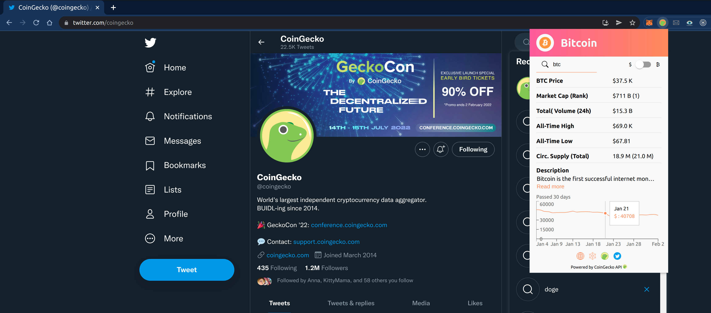
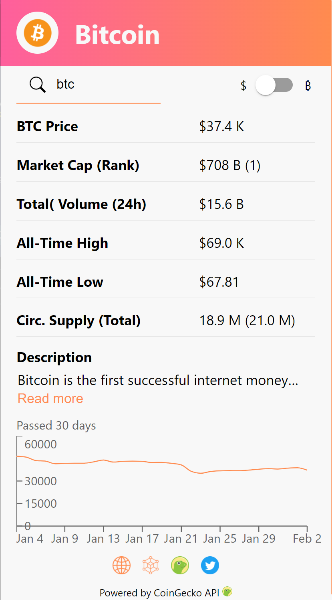
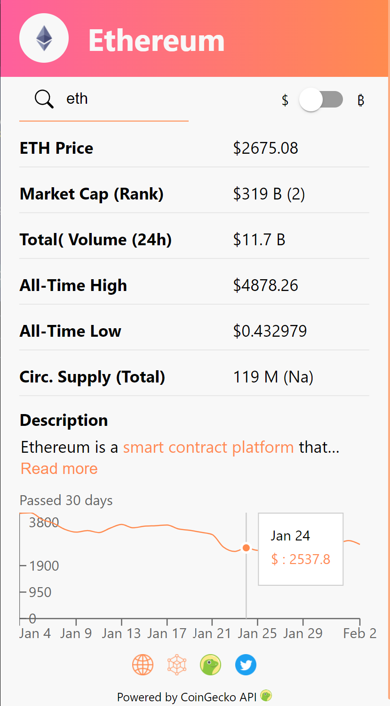
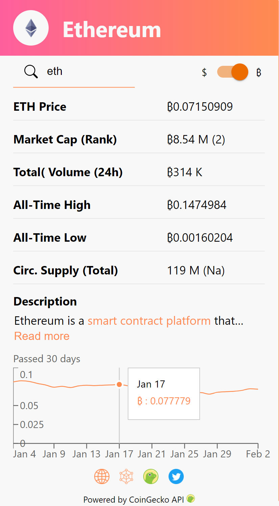
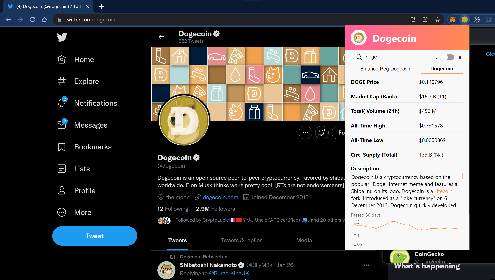
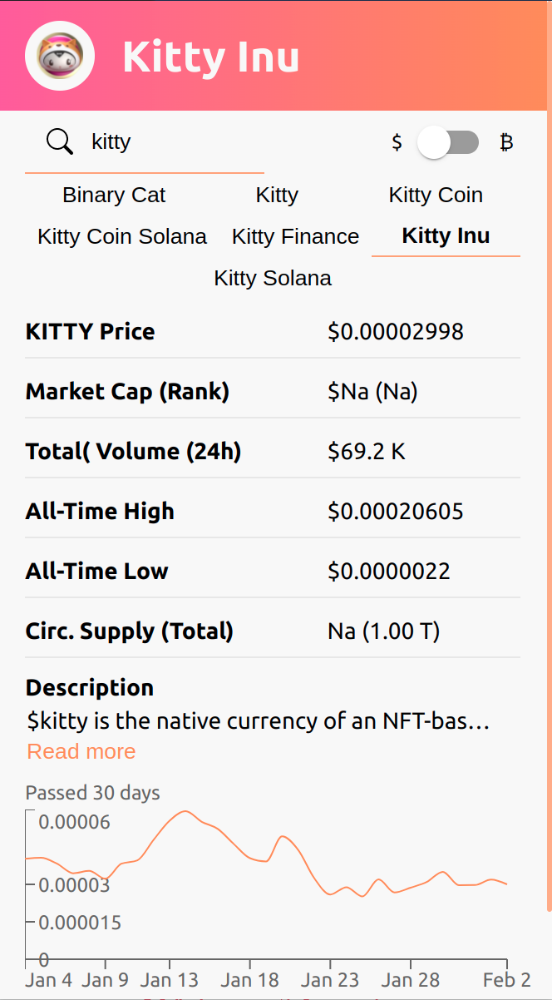

# Cryptocurrency Chrome extension

A Google Chrome extension which displays information about a cryptocurrency in a popup when the user selects a coin ticker (BTC/ ETH/ XYZ) and presses CTRL+SHIFT+L, or uses the search feature.

## Acknowledgements

I would like to thank CoinGecko for providing real-time cryptocurrency data at no cost;
[CoinGecko-API](https://www.coingecko.com/en/api).

# Previews

## Preview Video

[Crypto Explorer Chrome Extension Preview](https://www.youtube.com/watch?v=73Cn0ROcvVA)

## BTC/USD pop-up on Twitter with price graph tooltip

  

## BTC/USD pop-up

  

## ETH/USD pop-up with price graph tooltip

  

## ETH/BTC pop-up with price graph tooltip

  

## DOGE/USD pop-up on Twitter with extended description

  

## KITTY/USD pop-up with navigation bar of coins with the same ticker

  

### To do's/ Ideas

- Style graph y-axis, done
- Don't close extension after link click, done
- Ready to type on search bar the token you are looking for, done
- Top Trending coins CoinGecko; idea grey out, burn if clicked, done

- Display price at certain marketcap; if x has same MC a y then x price is z
- Connect LunaCrush; show top influencers and recent trend stats; read top tweets.
- USD chart \$BTRFLY out of range
