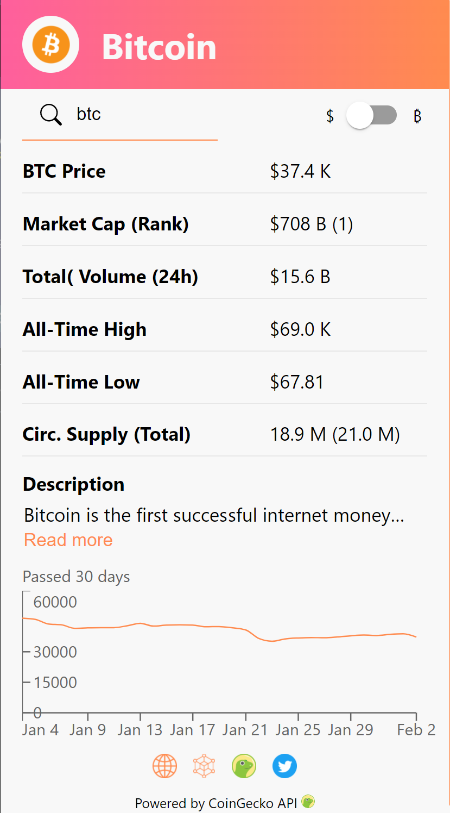
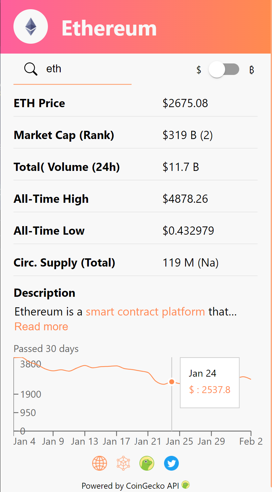
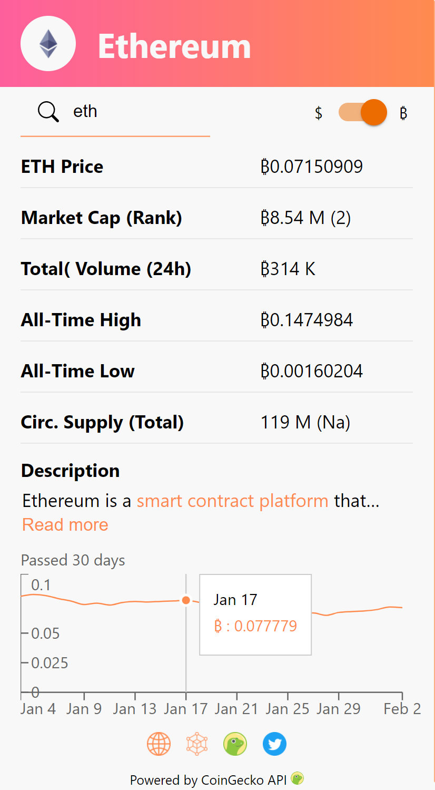
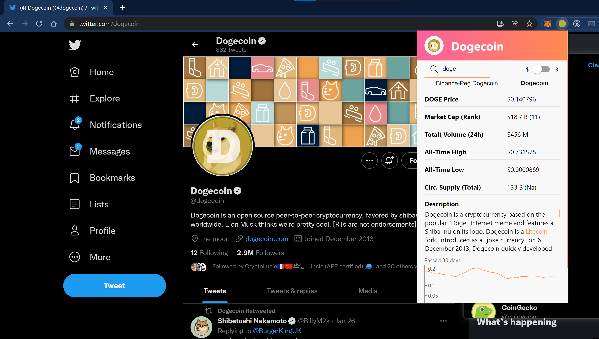
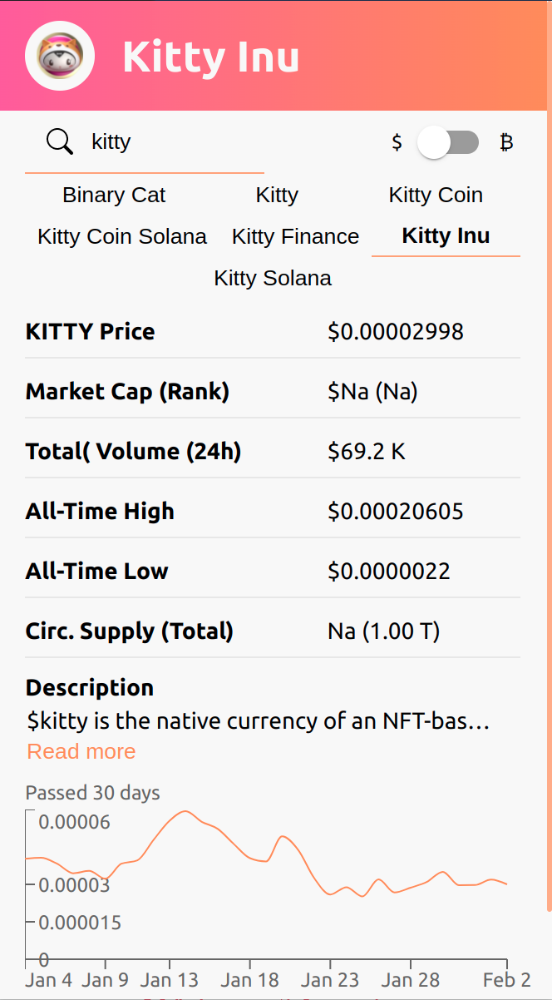

# Cryptocurrency Chrome extension

A Google Chrome extension which displays information about a cryptocurrency in a popup when the user selects a coin ticker (BTC/ ETH/ XYZ) and presses CTRL+SHIFT+L or uses the search feature.

## Previews

### BTC/USD pop-up

  

### ETH/USD pop-up with price graph tooltip

  

### ETH/BTC pop-up with price graph tooltip

  

### DOGE/USD pop-up on Twitter with extended description

  

### KITTY/USD pop-up with navbar of coins with the same ticker

  

Created by https://www.linkedin.com/in/martijnvanven/
