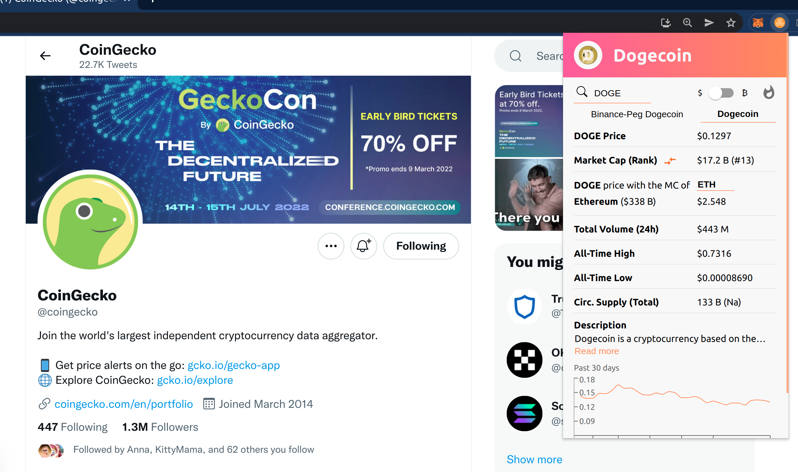

# Cryptocurrency Explorer Chrome Extension

A Google Chrome extension which displays information about a cryptocurrency in a popup when the user selects a coin ticker (BTC/ ETH/ XYZ) and presses (mac)CTRL+SHIFT+U. It's also possible to use the search feature, check the top searched coins of CoinGecko in the last 24 hours or compare market caps of different tokens; What would the price of coin x be with the market cap of coin Y.

[Chrome Store Extension Link](https://chrome.google.com/webstore/detail/crypto-explorer/pkaheoacmbdgnemgmcdbekniooabcnmc)

## Acknowledgements

I would like to thank CoinGecko for providing real-time cryptocurrency data at no cost;
[CoinGecko-API](https://www.coingecko.com/en/api).

# Previews

## Preview Video

[Crypto Explorer Chrome Extension Preview](https://www.youtube.com/watch?v=GZUmctdYTP0)

## BTC/USD pair with price graph tooltip

  

## ETH/BTC pair with extended description

  

## WOO/USD pair with on-chain activity

  

## Compare-marketcap tool

  

## Top searched coins of CoinGecko in the last 24 hours

  

### To do's/ Ideas

- twitter info

- Connect LunaCrush; show top influencers and recent trend stats; read top tweets; paid API needed.

#### Done

- Style graph y-axis, done
- Don't close extension after link click, done
- Ready to type on search bar the token you are looking for, done
- Top Trending coins CoinGecko; idea grey out, burn if clicked, done
- Show clickable , done
- Display price at certain marketcap; if x has same MC a y then x price is z, done
- More smooth chart transition, done
- Another little addition could be have a # next to the market cap rank; WOO #166, done
- When you search for a new coin, I think the dropdown with the coin name should be highlighted so its more obvious to click; pointer change implemented
- USD chart \$BTRFLY out of range, fixed
- Max days graph range, done
- Display on-chain activity
